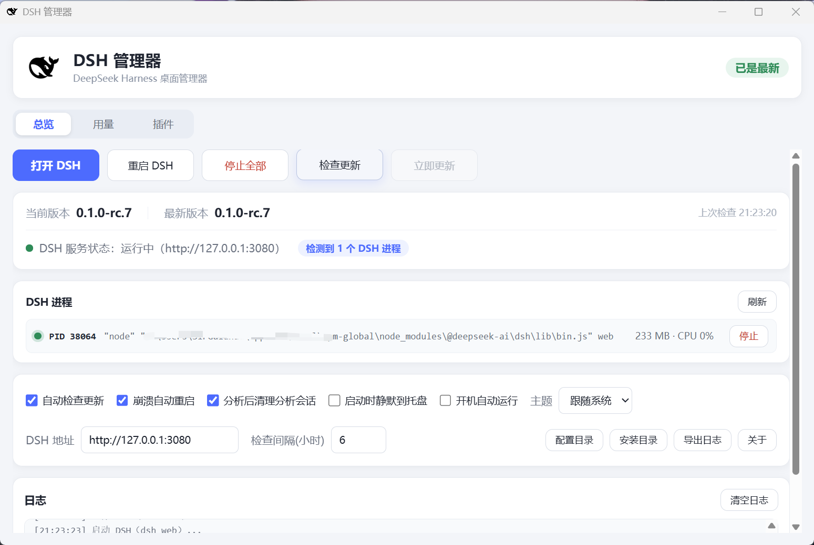
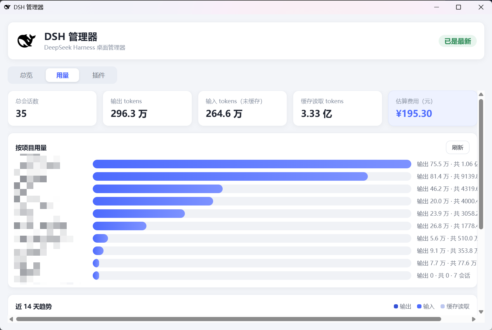
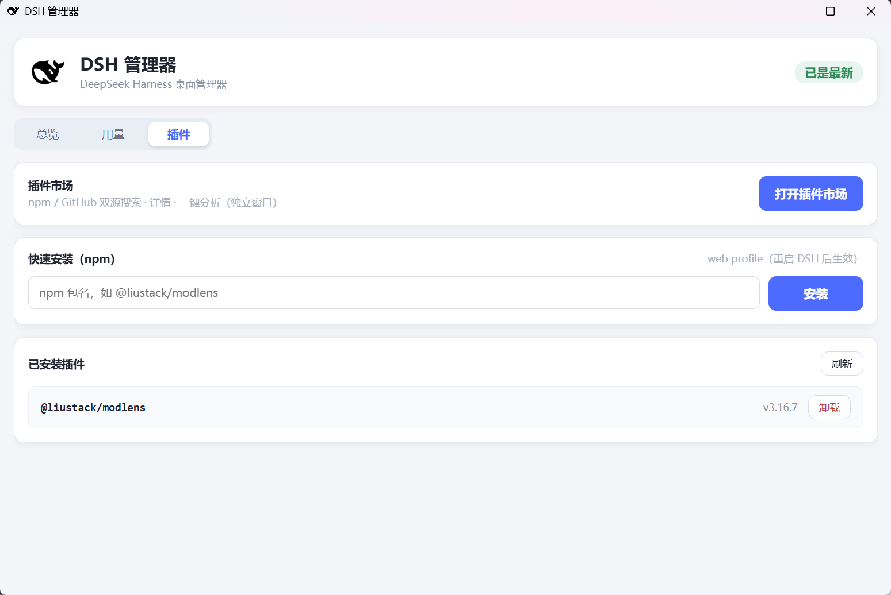
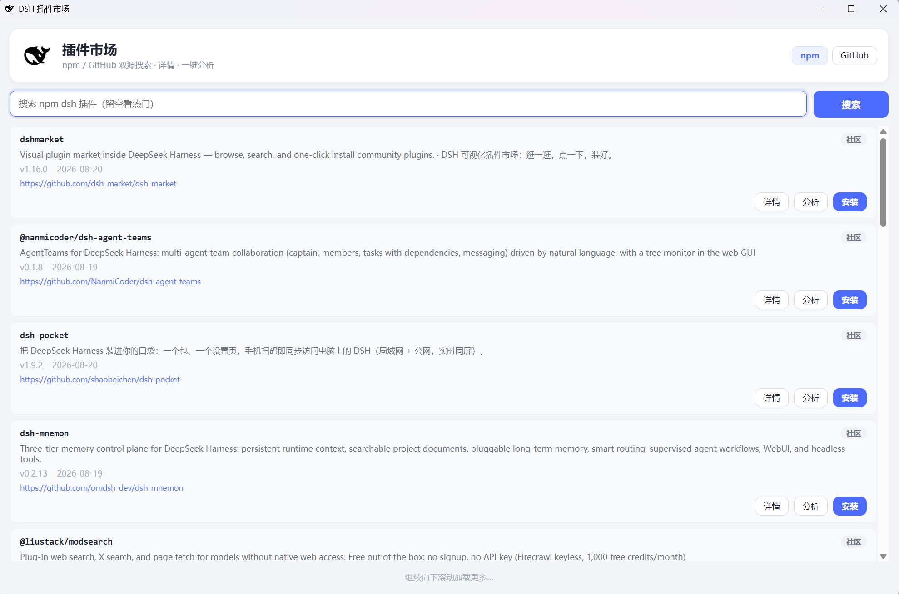
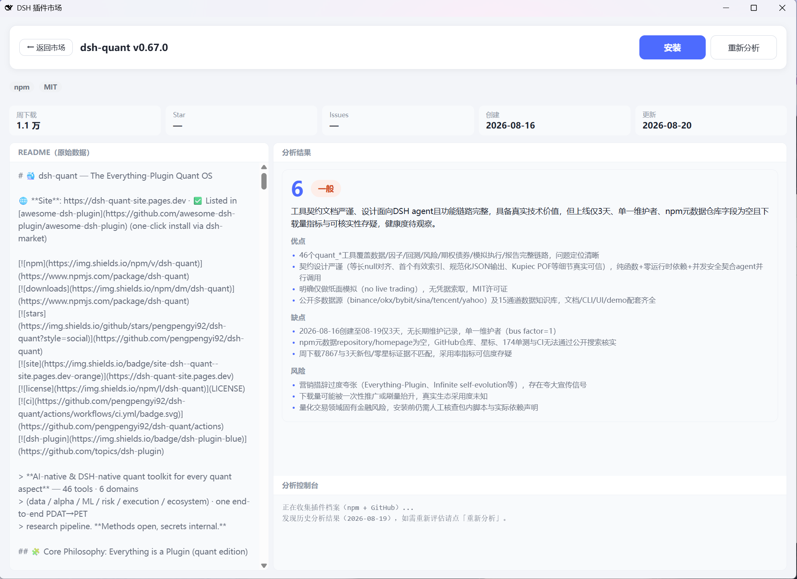

# DSH 管理器

[](https://github.com/modred522/dsh-manager/actions/workflows/check.yml)
[](LICENSE)
[](https://www.electronjs.org/)

DeepSeek Harness（dsh）的 Electron 桌面管理器：托盘常驻、一键启停、更新管理、插件市场与智能分析、Token 用量统计。

[English](README.en.md) | 中文

## 截图

<table>
  <tr>
    <td align="center"><b>总览</b>（版本 / 进程 / 更新 / 设置 / 日志）<br></td>
    <td align="center"><b>用量</b>（Token 统计 / 项目排行 / 14 天趋势）<br></td>
  </tr>
  <tr>
    <td align="center"><b>插件</b>（已安装管理 / 快速安装）<br></td>
    <td align="center"><b>插件市场</b>（独立窗口，npm / GitHub 双源）<br></td>
  </tr>
  <tr>
    <td align="center" colspan="2"><b>插件详情 + 一键分析</b>（README / 评分卡 / 控制台，可拖拽分栏）<br></td>
  </tr>
</table>

## 功能

| 页签 | 功能 |
|---|---|
| 总览 | 打开/重启/停止 DSH（检测所有 dsh 进程）、进程面板（PID/内存/CPU/单个停止）、检查更新/立即更新/回滚（带官方 changelog）、设置（自启/守护/静默/主题/地址/间隔）、日志（持久化 7 天 + 导出）、工具（配置目录/安装目录/关于） |
| 用量 | Token 统计：总量、按项目排行、近 14 天趋势、费用估算（单价可调） |
| 插件 | 已安装插件管理 + 快速安装（npm）；**插件市场**（npm / GitHub 双源搜索）为**独立窗口**，点按钮打开；卡片直接展示 GitHub 页面链接（点击用系统浏览器打开）；插件详情为整页视图（README / 评分卡 / 控制台**可拖拽分栏**）、**一键分析**（dsh headless 评估"真实有用/徒有其表"，结构化评分卡 + 历史缓存）、安装/卸载（GitHub 源带供应链风险确认） |

## 快速开始

- **运行**：双击桌面「DSH 管理器」快捷方式；或在项目目录执行 `npm start`。
- **退出**：托盘图标右键 → 退出（关闭窗口只是最小化到托盘）。
- **全局快捷键**：`Ctrl+Alt+D` 快速打开 DSH。

## 全新机器安装

```powershell
npm install -g @deepseek-ai/dsh      # 前置：安装 DeepSeek Harness CLI
git clone https://github.com/modred522/dsh-manager.git && cd dsh-manager
npm install
npm start
```

## 目录结构

```
dsh-manager
├── main.js                 # 主进程全部逻辑
├── preload.js              # IPC 桥（window.dsh）
├── find-dsh.ps1            # dsh 进程 WMI 详情（纯 ASCII）
├── .github/workflows/      # CI（push/PR 自动语法检查）
├── tools/
│   ├── render-icon.ps1     # 鲸鱼图标生成（STA 运行）
│   └── publish.ps1         # 一键发布到 GitHub
├── assets/                 # whale.png / app.ico / screenshots/
├── renderer/               # 主窗口：index.html + styles.css + renderer.js
│                           # 插件市场独立窗口：market.html + market.js
└── docs/                   # MEMORY.md（交接）/ ARCHITECTURE.md / GOTCHAS.md
```

## 常用开发命令

```powershell
npm start                                  # 启动应用
node --check main.js                       # 语法检查（preload.js、renderer/*.js 同理）
Get-Process electron | Stop-Process -Force # 改完代码杀旧实例
powershell -NoProfile -STA -File tools\render-icon.ps1  # 重新生成鲸鱼图标
powershell -NoProfile -File tools\publish.ps1  # fork 后一键发布到自己的 GitHub 仓库
```

## 相关文档

- **`docs/MEMORY.md`**：项目交接记忆（新会话必读）
- **`docs/ARCHITECTURE.md`**：代码地图、IPC 契约、数据结构、扩展指南
- **`docs/GOTCHAS.md`**：踩坑记录与交付检查清单

## 依赖

- Node.js 24 / npm 11 / Electron 43.4.0（`npm install` 安装）
- dsh（npm 全局，`@deepseek-ai/dsh`）、DSH_HOME 默认 `~\.dsh`

## 致谢

- 鲸鱼图标由 DeepSeek Harness（dsh，MIT License）的 favicon 路径渲染生成。

## 许可证

[MIT](LICENSE)
